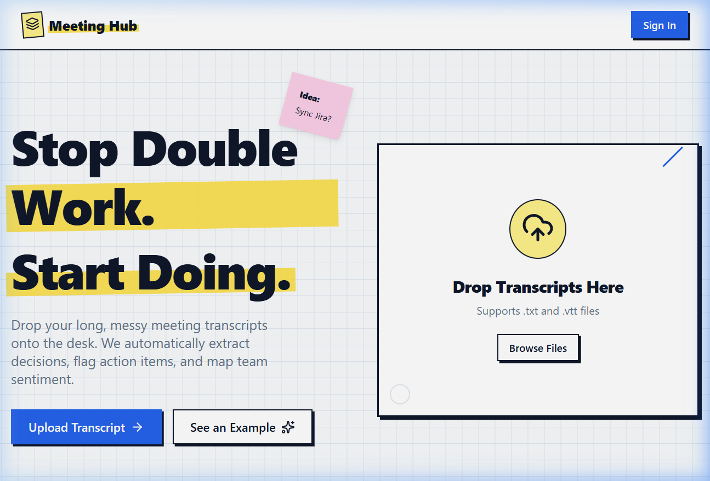
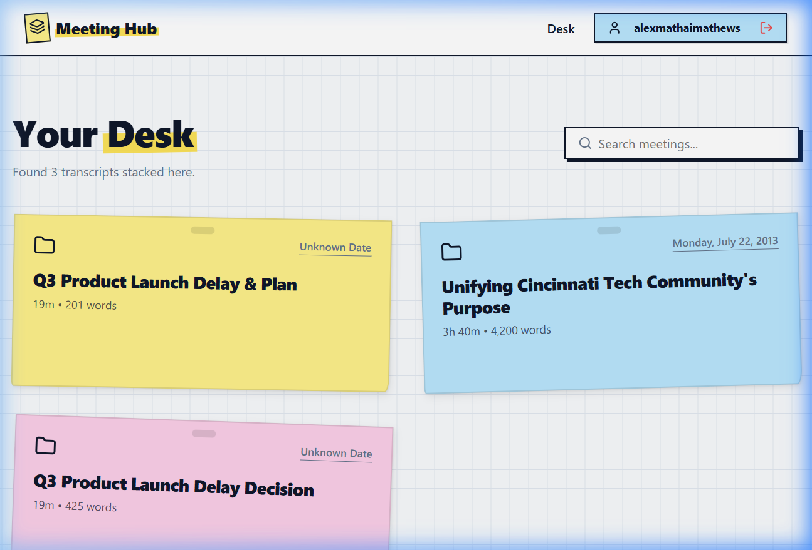
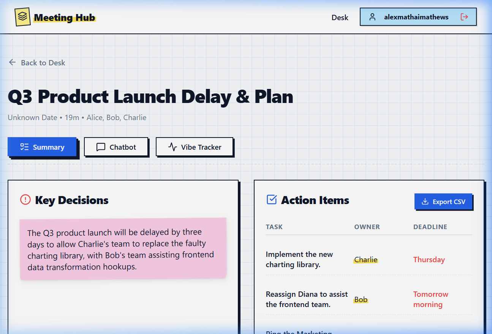
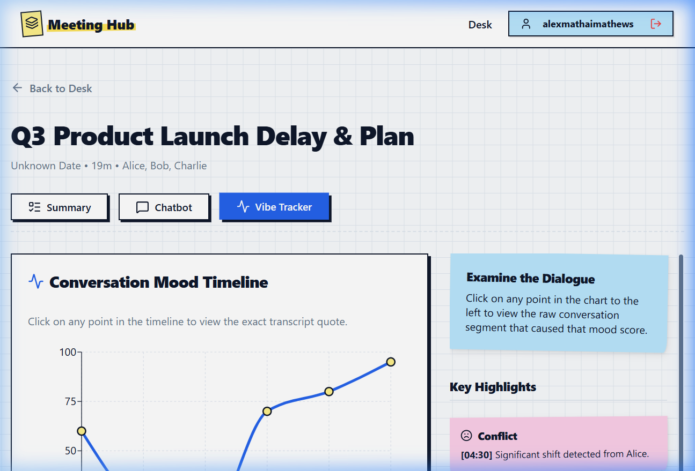

# Meeting Intelligence Hub

Meeting Intelligence Hub is a productivity platform designed to transform raw meeting transcripts into actionable insights. By leveraging Google Gemini AI and Firebase, the application automatically extracts decisions, action items, and analyzes speaker sentiment to provide a comprehensive post-meeting experience.

## Key Features

- **Automated Transcript Parsing**: Upload `.txt` or `.vtt` meeting transcripts to automatically extract key decisions and assignable action items.
- **Interactive Sentiment Analysis**: Visualize the "vibe" of the meeting through a segmented timeline. Click on specific data points to view the exact transcript segment that influenced the sentiment score.
- **Context-Aware Chatbot**: Interact with a dedicated AI assistant specifically trained on the current meeting's transcript to ask follow-up questions or clarify details.
- **Secure Authentication**: Built-in user registration and login system powered by Firebase Authentication.
- **Persistent Storage**: All parsed meeting data is securely stored and synchronized via Cloud Firestore.

## Application Overview

### Landing Page
The entry point where users can drag and drop transcripts for instant analysis.


### Dashboard
A personalized "Desk" view displaying all previously uploaded and analyzed meetings with at-a-glance statistics.


### Meeting Details
A detailed breakdown of meeting intelligence categorized by Summary, AI Chat, and Sentiment tracking.

#### Summary Tab
Displays high-level decisions and a structured table of action items with owners and deadlines.


#### Chatbot Tab
Enable users to query the meeting context using natural language.


#### Vibe Tracker Tab
An interactive mood timeline showing the flow of the conversation and highlighting consensus or conflict points.


## Technology Stack

- **Frontend**: React (Vite)
- **Styling**: Vanilla CSS (Custom "Desk/Sketch" Design System)
- **Database**: Cloud Firestore
- **Authentication**: Firebase Auth
- **AI Engine**: Google Gemini (via `@google/generative-ai`)
- **Visualizations**: Recharts
- **Iconography**: Lucide React

## Getting Started

### Prerequisites

- Node.js (v18+)
- A Google AI Studio API Key (Gemini)
- A Firebase Project with Firestore and Auth enabled

### Installation

1. Clone the repository:
   ```bash
   git clone <repository-url>
   cd meeting-hub
   ```

2. Install dependencies:
   ```bash
   npm install
   ```

3. Configure Environment Variables:
   Create a `.env.local` file in the root directory and add your credentials:
   ```env
   VITE_FIREBASE_API_KEY=your_key
   VITE_FIREBASE_AUTH_DOMAIN=your_domain
   VITE_FIREBASE_PROJECT_ID=your_id
   VITE_FIREBASE_STORAGE_BUCKET=your_bucket
   VITE_FIREBASE_MESSAGING_SENDER_ID=your_id
   VITE_FIREBASE_APP_ID=your_app_id
   VITE_GEMINI_API_KEY=your_gemini_key
   ```

4. Run the development server:
   ```bash
   npm run dev
   ```

## License
MIT
