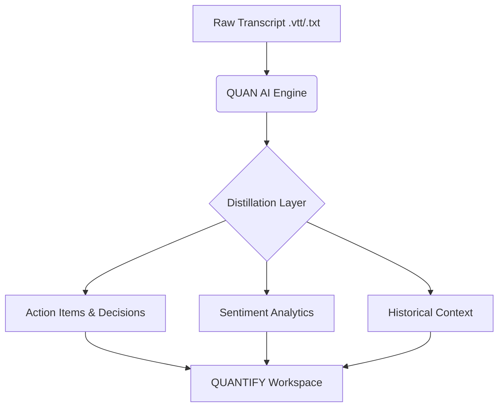
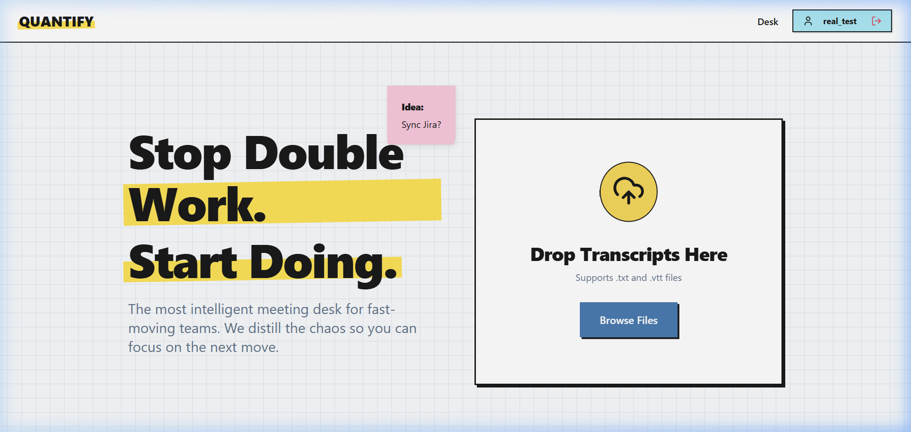
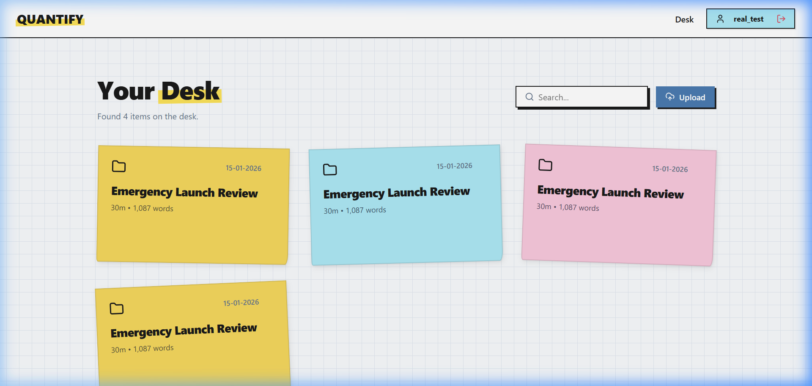

# QUANTIFY

QUANTIFY is a high-performance meeting intelligence platform designed to transform the noise of raw dialogue into structured, actionable data. It eliminates the "Double Work" cycle by distilling expansive transcripts into a single, authoritative source of truth.

## The Problem

Modern organizations generate dozens of expansive meeting transcripts weekly, often exceeding twenty pages in length. Critical outcomes—decisions, action items, and strategic reasoning—are frequently buried in pages of dialogue, forcing teams into a painful "Double Work" cycle of re-discussing things that were already decided instead of executing on them.

## The Solution

QUANTIFY is an intelligent meeting intelligence platform that automatically distills raw conversation into structured, actionable data. By utilizing high-performance language models to extract key points and visualize interaction sentiment, it eliminates administrative overhead and ensures teams move from discussion to delivery without friction.

## System Architecture



---

## Key Features

- **Automated Distillation**: Automatically extract meeting outcomes, owners, and deadlines from raw dialogue.
- **Sentiment Analytics**: Visualize high-impact moments and technical blockers through a precise interaction timeline.
- **Historical Context (QUAN)**: A dedicated AI assistant trained on your meeting history to recover exactly what was said and why.
- **Rigid Data Structure**: All parsed information is organized into a persistent, searchable workspace powered by Cloud Firestore.

## Application Overview

### The Landing Page
Distill chaos instantly with a simple drag-and-drop workspace.


### The Workspace (Your Desk)
A centralized hub for all meeting intelligence, organized by date and impact.


---

## Tech Stack

- **Frontend**: React (Vite)
- **Animations**: Framer Motion (3D Rotating Features)
- **Data Visualization**: Recharts
- **Database**: Cloud Firestore (NoSQL)
- **Authentication**: Firebase Auth
- **AI Engine**: Groq (Llama 3.3 70B Versatile)
- **Iconography**: Lucide React

## Setup Instructions

### Prerequisites

- Node.js (v18+)
- A Groq API Key
- A Firebase Project (Firestore & Auth enabled)

### Local Installation

1. **Clone & Enter Registry**:
   ```bash
   git clone <repository-url>
   cd quantify-desk
   ```

2. **Initialize Dependencies**:
   ```bash
   npm install
   ```

3. **Configure Environment**:
   Create a `.env.local` file in the root directory:
   ```env
   VITE_FIREBASE_API_KEY=your_key
   VITE_FIREBASE_AUTH_DOMAIN=your_domain
   VITE_FIREBASE_PROJECT_ID=your_id
   VITE_FIREBASE_STORAGE_BUCKET=your_bucket
   VITE_FIREBASE_MESSAGING_SENDER_ID=your_id
   VITE_FIREBASE_APP_ID=your_app_id
   VITE_GROQ_API_KEY=your_groq_key
   ```

4. **Launch Dev Server**:
   ```bash
   npm run dev
   ```

---

## License
MIT © 2026 QUANTIFY Team
