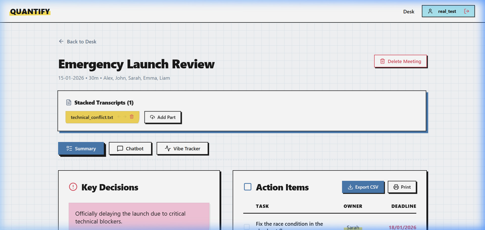
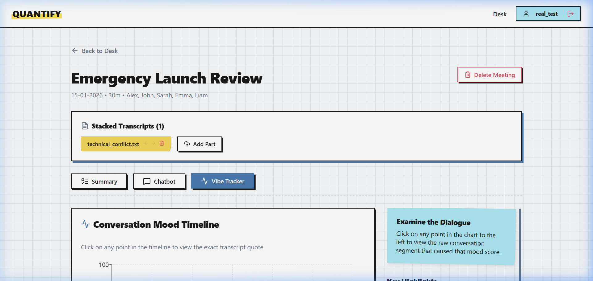
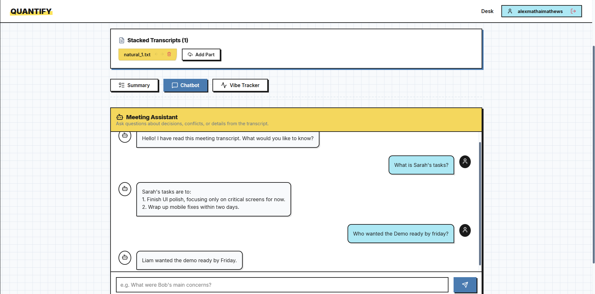
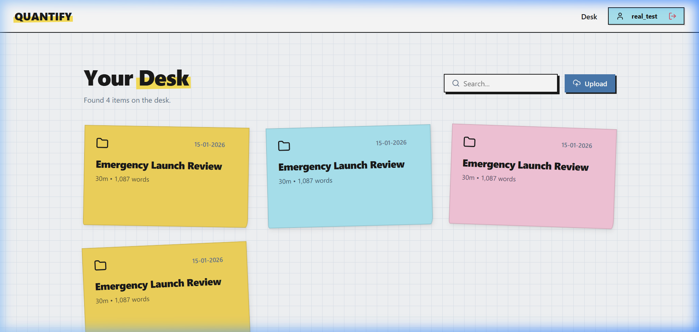

# QUANTIFY 

[](YOUR_GOOGLE_DRIVE_LINK_HERE)

[](https://reactjs.org/)
[](https://firebase.google.com/)
[](https://groq.com/)
[](https://opensource.org/licenses/MIT)

**QUANTIFY** is a high-performance meeting intelligence platform designed to transform the noise of raw dialogue into structured, actionable data. It eliminates the "Double Work" cycle by distilling expansive transcripts into a single, authoritative source of truth.

---

## The Problem

Modern organizations generate dozens of expansive meeting transcripts weekly, often exceeding twenty pages in length. Critical outcomes—decisions, action items, and strategic reasoning—are frequently buried in pages of dialogue, forcing teams into a painful **"Double Work"** cycle of re-discussing things that were already decided instead of executing on them.

## The Solution

QUANTIFY is an intelligent meeting intelligence platform that automatically distills raw conversation into structured, actionable data. By utilizing high-performance language models to extract key points and visualize interaction sentiment, it eliminates administrative overhead and ensures teams move from discussion to delivery without friction.

---

## System Architecture

```mermaid
graph LR
    Input[Raw Transcript .vtt/.txt] --> EmbedStore[(Vector Embeddings)]
    Input --> Engine(QUAN AI Engine)
    Engine --> Logic{Distillation Layer}
    Logic --> Items[Action Items & Decisions]
    Logic --> Sentiment[Sentiment Analytics]
    Logic --> Context[Meeting Specific Recall]
    EmbedStore --> GlobalRAG{Global Workspace RAG}
    GlobalRAG --> GlobalContext[Cross-Meeting Recall]
    Items & Sentiment & Context & GlobalContext --> Workspace[QUANTIFY Workspace]
    style Engine fill:#7a6818,stroke:#1a1a1a,stroke-width:2px
    style Workspace fill:#1c1d66,stroke:#1a1a1a,stroke-width:2px
```



---

## Core Functionality

| **Distilled Intelligence** | **Atmospheric Awareness** |
| :---: | :---: |
|  |  |
| **Outcomes & Assignments**: Automated extraction of decisions and tasks. | **Sentiment Analytics**: Visualize interaction peaks and blockers. |
| **Instant Recall (QUAN)** | **The Digital Desk** |
|  |  |
| **Meeting Context**: Chat with meeting data for deep clarification. | **Centralized Hub**: A persistent, 'Post-it' style meeting registry. |
| **Workspace Health (Analytics)** | **Master Task Board** |
| *(Recharts Visualizations)* | *(Kanban Task List)* |
| **Organizational Analytics**: Graphs team morale and task velocity across all meetings. | **Action Items Central**: Master checklist tracking every employee's assignments. |
| **Global RAG Chatbot** | |
| *(Vector Retrieval)* | |
| **Cross-Meeting Intelligence**: True math-based vector RAG searches across your entire workspace history! | |

---

## Tech Stack

*   **Runtime**: [Node.js](https://nodejs.org/) (Vite)
*   **Intelligence**: [Groq SDK](https://groq.com/) (Llama 3.3 70B Versatile)
*   **Vector Retrieval (RAG)**: [Google Gemini](https://ai.google.dev/) (Text-Embedding-004)
*   **Database & Auth**: [Firebase](https://firebase.google.com/) (Cloud Firestore)
*   **Animations**: [Framer Motion](https://www.framer.com/motion/) (3D UI & Transitions)
*   **Visualization**: [Recharts](https://recharts.org/)
*   **Design System**: [Vanilla CSS](https://developer.mozilla.org/en-S/docs/Web/CSS) (Sketchbook Aesthetic)

---

## Setup Instructions

### 1. Initialize Registry
```bash
git clone <repository-url>
cd quantify-desk
npm install
```

### 2. Configure Environment
Create a `.env.local` file in the root directory:
```env
VITE_FIREBASE_API_KEY=your_key
VITE_FIREBASE_AUTH_DOMAIN=your_domain
VITE_FIREBASE_PROJECT_ID=your_id
VITE_GROQ_API_KEY=your_groq_key
VITE_GEMINI_API_KEY=your_gemini_key
```

### 3. Launch Workspace
```bash
npm run dev
```

---

## License
MIT © 2026 QUANTIFY Team
